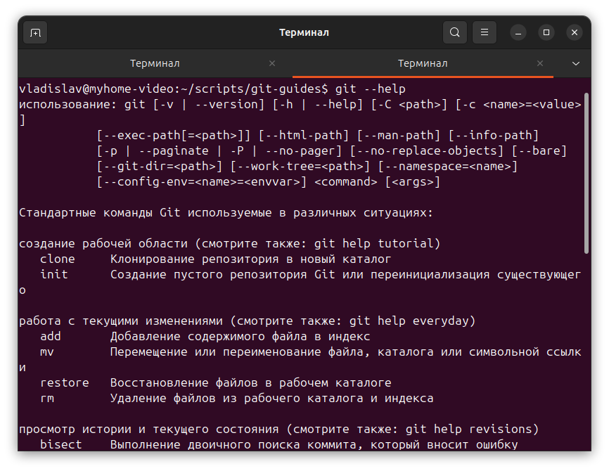

# Git Guides — Мини-курс по работе с Git и GitHub

[🇬🇧 English](../../README.md) | [🇷🇺 Русский](README_GIT_WORKING_RU.md)

📚 Этот репозиторий создан для начинающих разработчиков и всех, кто хочет изучить **основы работы с Git и GitHub**, а также научиться вести репозитории по стандартам.  

Ресурсы включают инструкции, примеры, шаблоны и пошаговые учебные материалы.

## 🚀 С чего начать

1. Если вы совсем новичок, откройте `tutorials/step-by-step-git-tutorial.md` для пошагового изучения Git.  
2. Затем ознакомьтесь с `docs/`, чтобы понять стандарты работы с репозиторием и ветвления.  
3. Используйте `examples/` для практики и закрепления знаний.  
4. Применяйте готовые шаблоны из `templates/` для своих проектов.

## 📂 Структура репозитория

### 1️⃣ docs/ — Основные инструкции и стандарты
- [REPOSITORY_STANDARDS_RU.md](README_REPOSITORY_STANDARDS_RU.md) — стандарты работы с репозиторием.  
- [BRANCHING_STRATEGY.md](docs/RU/BRANCHING_STRATEGY_RU.md) *(planned)* — рекомендации по ветвлению.  
- [COMMIT_GUIDELINES.md](README_GIT_COMMIT_GUIDELINES_RU.md) — правила написания коммитов.  
- [PULL_REQUEST_PROCESS.md](docs/RU/PULL_REQUEST_PROCESS_RU.md) *(planned)* — процесс работы с pull request.  

### 2️⃣ examples/ — Примеры практического применения
- Примеры работы с ветками, коммитами, разрешением конфликтов.

### 3️⃣ tutorials/ — Пошаговые инструкции
- `step-by-step-git-tutorial.md` — мини-курс для новичков, начиная с установки Git и до работы с GitHub.

### 4️⃣ templates/ — Готовые шаблоны для проектов
- [README_TEMPLATE_RU.md](templates/README_TEMPLATE_RU.md) — шаблон README для новых проектов.  
- `ISSUE_TEMPLATE.md` — шаблон для создания issues.  
- `PULL_REQUEST_TEMPLATE.md` — шаблон для pull request.  

## 💡 Как использовать

- Читайте инструкции в `docs/` и выполняйте шаги из `tutorials/`.  
- Пробуйте создавать ветки и коммиты на практике, используя `examples/`.  
- Подключайте шаблоны из `templates/` к своим репозиториям.  
- Если что-то непонятно — создайте issue или pull request в этом репозитории для обсуждения.

## 📣 Участие и помощь

Этот репозиторий открыт для предложений и улучшений.  
Если хотите добавить учебный материал, исправить ошибки или предложить новые шаблоны — создавайте **pull request**.  

### ⚡ Быстрые ссылки

- [docs/](../) — инструкции и стандарты  
- [images/](../../images/) - screenshots
- [examples/](../../examples/) — примеры работы  
- [tutorials/](../../tutorials/) — пошаговое обучение  
- [templates/](../../templates/) — готовые шаблоны  

## 🖼️ Screenshots

 
 
 
 

